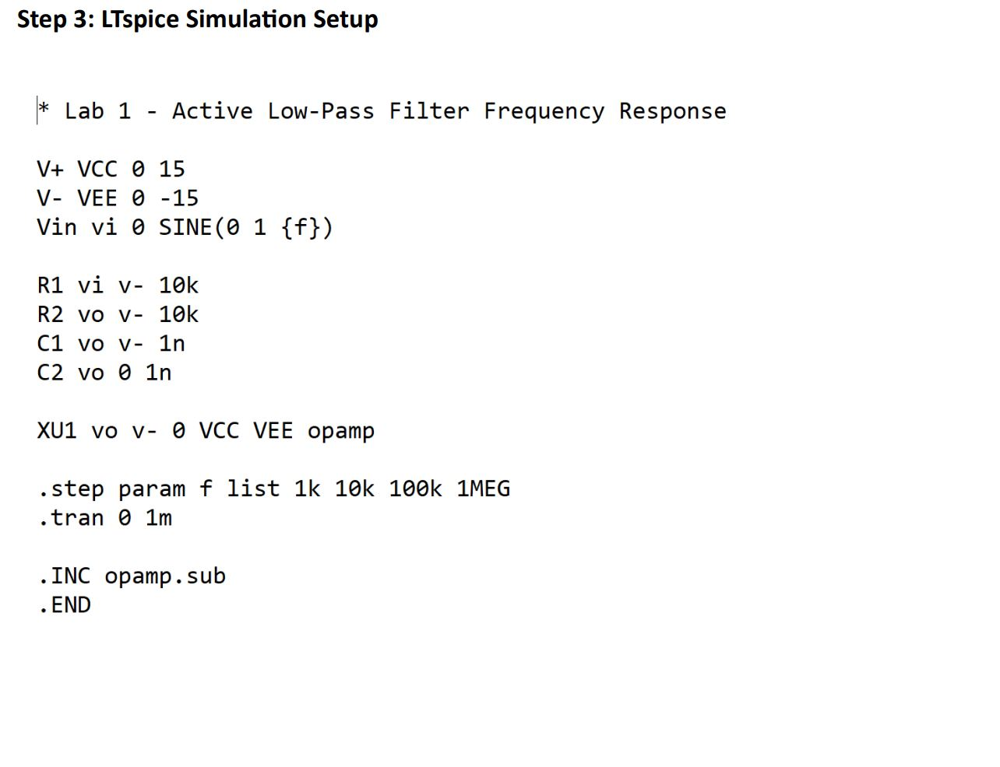
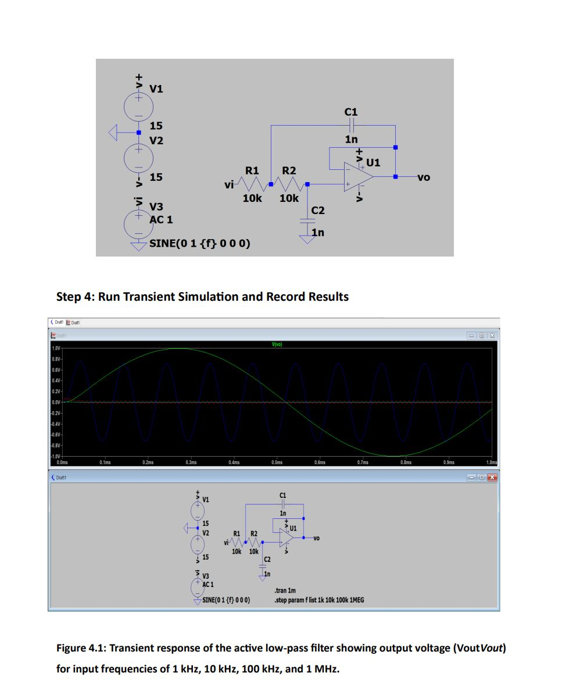
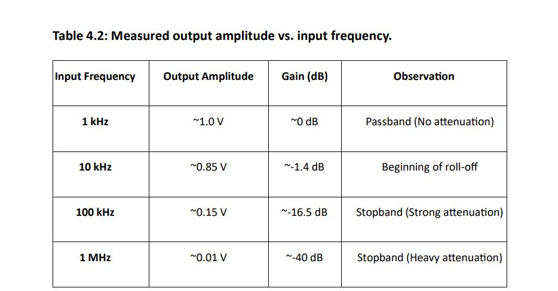

# Active Low-Pass Filter Simulation

## Objective

This project investigates the frequency response of an active low-pass filter using LTspice.

The simulation focuses on the cutoff frequency, passband behavior, stopband attenuation, and transient response of the filter.

## Simulation Environment

- Simulation Tool: LTspice XVII
- Circuit Type: Active Low-Pass Filter
- Analysis: AC Analysis and Transient Analysis
- Operational Amplifier: Ideal Op-Amp

## Circuit Parameters

The filter was simulated using the component values specified in the Integrated Circuit CAD Design laboratory work.

The theoretical cutoff frequency was calculated as approximately:

**fc ≈ 15.9 kHz**

## Frequency Response

The circuit was evaluated at different input frequencies to observe how the output amplitude changes with frequency.

The main test frequencies included:

- 1 kHz
- 10 kHz
- 100 kHz
- 1 MHz

The simulation demonstrates the expected low-pass behavior: signals within the passband are passed with relatively high gain, while higher-frequency signals are increasingly attenuated.

## Results

The simulation results were analyzed using LTspice waveforms and frequency-response characteristics.

Key observations:

- Low-frequency signals pass through the filter.
- The response decreases as the frequency increases.
- The cutoff region occurs around the calculated cutoff frequency.
- High-frequency signals experience significant attenuation.

## Conclusion

The simulation demonstrates the frequency-selective behavior of an active low-pass filter.

The LTspice results are consistent with the expected low-pass response and provide practical insight into cutoff frequency, passband behavior, and high-frequency attenuation.

## Simulation Setup

The LTspice simulation was configured according to the laboratory specifications.

## Circuit Schematic

The active low-pass filter circuit was implemented in LTspice.

## Simulation Results

The transient response was evaluated at different input frequencies, including 1 kHz, 10 kHz, 100 kHz, and 1 MHz.

